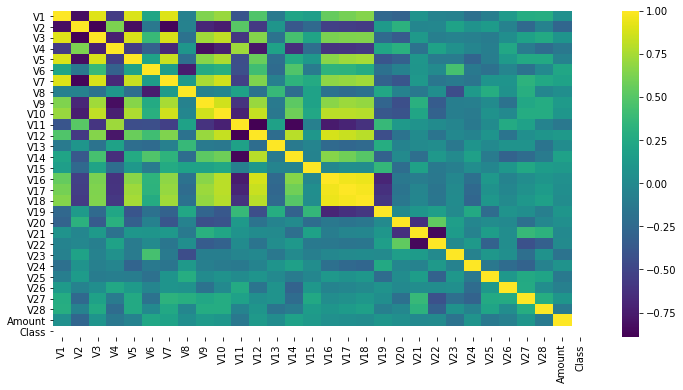

# Detecção de Fraudes com Cartões de Crédito


## Classificando dados anônimos de transações por cartão de crédito como fraudulentas ou genuínas

Neste repo, foi analisado um dataset muito popular que trata de fraudes com cartões de crédito. O objetivo é classificar transações como fraudulentas ou genuínas.

Tirado da página do dataset no [Kaggle](https://www.kaggle.com/mlg-ulb/creditcardfraud):


*The datasets contains transactions made by credit cards in September 2013 by european cardholders.
This dataset presents transactions that occurred in two days, where we have 492 frauds out of 284,807 transactions. The dataset is highly unbalanced, the positive class (frauds) account for 0.172% of all transactions.*

*It contains only numerical input variables which are the result of a PCA transformation. Unfortunately, due to confidentiality issues, we cannot provide the original features and more background information about the data. Features V1, V2, … V28 are the principal components obtained with PCA, the only features which have not been transformed with PCA are 'Time' and 'Amount'. Feature 'Time' contains the seconds elapsed between each transaction and the first transaction in the dataset. The feature 'Amount' is the transaction Amount, this feature can be used for example-dependant cost-senstive learning. Feature 'Class' is the response variable and it takes value 1 in case of fraud and 0 otherwise.*


# Importando bibliotecas e dados


```python
import pandas as pd
import numpy as np
import seaborn as sns
import matplotlib.pyplot as plt

from sklearn.preprocessing import RobustScaler
from sklearn.model_selection import train_test_split, GridSearchCV
from sklearn.linear_model import LogisticRegression
from sklearn.utils import class_weight
from sklearn.metrics import classification_report, confusion_matrix, recall_score

from mlxtend.classifier import EnsembleVoteClassifier

from keras.wrappers.scikit_learn import KerasClassifier

from tensorflow.keras.models import Sequential, load_model
from tensorflow.keras.layers import Dense, Activation, Dropout
from tensorflow.keras.optimizers import Adam
from tensorflow.keras.callbacks import EarlyStopping

import xgboost as xgb
```

    /usr/local/lib/python3.6/dist-packages/statsmodels/tools/_testing.py:19: FutureWarning: pandas.util.testing is deprecated. Use the functions in the public API at pandas.testing instead.
      import pandas.util.testing as tm
    Using TensorFlow backend.
    


```python
df = pd.read_csv('creditcardfraud.zip')
```

# Visualização de Dados


```python
df.info()
```

    <class 'pandas.core.frame.DataFrame'>
    RangeIndex: 284807 entries, 0 to 284806
    Data columns (total 31 columns):
     #   Column  Non-Null Count   Dtype  
    ---  ------  --------------   -----  
     0   Time    284807 non-null  float64
     1   V1      284807 non-null  float64
     2   V2      284807 non-null  float64
     3   V3      284807 non-null  float64
     4   V4      284807 non-null  float64
     5   V5      284807 non-null  float64
     6   V6      284807 non-null  float64
     7   V7      284807 non-null  float64
     8   V8      284807 non-null  float64
     9   V9      284807 non-null  float64
     10  V10     284807 non-null  float64
     11  V11     284807 non-null  float64
     12  V12     284807 non-null  float64
     13  V13     284807 non-null  float64
     14  V14     284807 non-null  float64
     15  V15     284807 non-null  float64
     16  V16     284807 non-null  float64
     17  V17     284807 non-null  float64
     18  V18     284807 non-null  float64
     19  V19     284807 non-null  float64
     20  V20     284807 non-null  float64
     21  V21     284807 non-null  float64
     22  V22     284807 non-null  float64
     23  V23     284807 non-null  float64
     24  V24     284807 non-null  float64
     25  V25     284807 non-null  float64
     26  V26     284807 non-null  float64
     27  V27     284807 non-null  float64
     28  V28     284807 non-null  float64
     29  Amount  284807 non-null  float64
     30  Class   284807 non-null  int64  
    dtypes: float64(30), int64(1)
    memory usage: 67.4 MB
    


```python
df.head()
```


<div>
<style scoped>
    .dataframe tbody tr th:only-of-type {
        vertical-align: middle;
    }

    .dataframe tbody tr th {
        vertical-align: top;
    }

    .dataframe thead th {
        text-align: right;
    }
</style>
<table border="1" class="dataframe">
  <thead>
    <tr style="text-align: right;">
      <th></th>
      <th>Time</th>
      <th>V1</th>
      <th>V2</th>
      <th>V3</th>
      <th>V4</th>
      <th>V5</th>
      <th>V6</th>
      <th>V7</th>
      <th>V8</th>
      <th>V9</th>
      <th>V10</th>
      <th>V11</th>
      <th>V12</th>
      <th>V13</th>
      <th>V14</th>
      <th>V15</th>
      <th>V16</th>
      <th>V17</th>
      <th>V18</th>
      <th>V19</th>
      <th>V20</th>
      <th>V21</th>
      <th>V22</th>
      <th>V23</th>
      <th>V24</th>
      <th>V25</th>
      <th>V26</th>
      <th>V27</th>
      <th>V28</th>
      <th>Amount</th>
      <th>Class</th>
    </tr>
  </thead>
  <tbody>
    <tr>
      <th>0</th>
      <td>0.0</td>
      <td>-1.359807</td>
      <td>-0.072781</td>
      <td>2.536347</td>
      <td>1.378155</td>
      <td>-0.338321</td>
      <td>0.462388</td>
      <td>0.239599</td>
      <td>0.098698</td>
      <td>0.363787</td>
      <td>0.090794</td>
      <td>-0.551600</td>
      <td>-0.617801</td>
      <td>-0.991390</td>
      <td>-0.311169</td>
      <td>1.468177</td>
      <td>-0.470401</td>
      <td>0.207971</td>
      <td>0.025791</td>
      <td>0.403993</td>
      <td>0.251412</td>
      <td>-0.018307</td>
      <td>0.277838</td>
      <td>-0.110474</td>
      <td>0.066928</td>
      <td>0.128539</td>
      <td>-0.189115</td>
      <td>0.133558</td>
      <td>-0.021053</td>
      <td>149.62</td>
      <td>0</td>
    </tr>
    <tr>
      <th>1</th>
      <td>0.0</td>
      <td>1.191857</td>
      <td>0.266151</td>
      <td>0.166480</td>
      <td>0.448154</td>
      <td>0.060018</td>
      <td>-0.082361</td>
      <td>-0.078803</td>
      <td>0.085102</td>
      <td>-0.255425</td>
      <td>-0.166974</td>
      <td>1.612727</td>
      <td>1.065235</td>
      <td>0.489095</td>
      <td>-0.143772</td>
      <td>0.635558</td>
      <td>0.463917</td>
      <td>-0.114805</td>
      <td>-0.183361</td>
      <td>-0.145783</td>
      <td>-0.069083</td>
      <td>-0.225775</td>
      <td>-0.638672</td>
      <td>0.101288</td>
      <td>-0.339846</td>
      <td>0.167170</td>
      <td>0.125895</td>
      <td>-0.008983</td>
      <td>0.014724</td>
      <td>2.69</td>
      <td>0</td>
    </tr>
    <tr>
      <th>2</th>
      <td>1.0</td>
      <td>-1.358354</td>
      <td>-1.340163</td>
      <td>1.773209</td>
      <td>0.379780</td>
      <td>-0.503198</td>
      <td>1.800499</td>
      <td>0.791461</td>
      <td>0.247676</td>
      <td>-1.514654</td>
      <td>0.207643</td>
      <td>0.624501</td>
      <td>0.066084</td>
      <td>0.717293</td>
      <td>-0.165946</td>
      <td>2.345865</td>
      <td>-2.890083</td>
      <td>1.109969</td>
      <td>-0.121359</td>
      <td>-2.261857</td>
      <td>0.524980</td>
      <td>0.247998</td>
      <td>0.771679</td>
      <td>0.909412</td>
      <td>-0.689281</td>
      <td>-0.327642</td>
      <td>-0.139097</td>
      <td>-0.055353</td>
      <td>-0.059752</td>
      <td>378.66</td>
      <td>0</td>
    </tr>
    <tr>
      <th>3</th>
      <td>1.0</td>
      <td>-0.966272</td>
      <td>-0.185226</td>
      <td>1.792993</td>
      <td>-0.863291</td>
      <td>-0.010309</td>
      <td>1.247203</td>
      <td>0.237609</td>
      <td>0.377436</td>
      <td>-1.387024</td>
      <td>-0.054952</td>
      <td>-0.226487</td>
      <td>0.178228</td>
      <td>0.507757</td>
      <td>-0.287924</td>
      <td>-0.631418</td>
      <td>-1.059647</td>
      <td>-0.684093</td>
      <td>1.965775</td>
      <td>-1.232622</td>
      <td>-0.208038</td>
      <td>-0.108300</td>
      <td>0.005274</td>
      <td>-0.190321</td>
      <td>-1.175575</td>
      <td>0.647376</td>
      <td>-0.221929</td>
      <td>0.062723</td>
      <td>0.061458</td>
      <td>123.50</td>
      <td>0</td>
    </tr>
    <tr>
      <th>4</th>
      <td>2.0</td>
      <td>-1.158233</td>
      <td>0.877737</td>
      <td>1.548718</td>
      <td>0.403034</td>
      <td>-0.407193</td>
      <td>0.095921</td>
      <td>0.592941</td>
      <td>-0.270533</td>
      <td>0.817739</td>
      <td>0.753074</td>
      <td>-0.822843</td>
      <td>0.538196</td>
      <td>1.345852</td>
      <td>-1.119670</td>
      <td>0.175121</td>
      <td>-0.451449</td>
      <td>-0.237033</td>
      <td>-0.038195</td>
      <td>0.803487</td>
      <td>0.408542</td>
      <td>-0.009431</td>
      <td>0.798278</td>
      <td>-0.137458</td>
      <td>0.141267</td>
      <td>-0.206010</td>
      <td>0.502292</td>
      <td>0.219422</td>
      <td>0.215153</td>
      <td>69.99</td>
      <td>0</td>
    </tr>
  </tbody>
</table>
</div>


```python
df.drop('Time', axis=1, inplace=True)
```


```python
df['Class'].value_counts(normalize=True)*100
```


    0    99.827251
    1     0.172749
    Name: Class, dtype: float64


```python
plt.figure(figsize=(12,6))
sns.heatmap(df[df['Class']==1].corr(), cmap='viridis')
```


    <matplotlib.axes._subplots.AxesSubplot at 0x7f61c5c4e940>





```python
df.corr()['Class'].drop('Class', axis = 0).plot(kind="bar", figsize=(12,6))
```


    <matplotlib.axes._subplots.AxesSubplot at 0x7f61c1b4f7b8>


# Dividindo dataset e treinando o modelo

A métrica utilizada para classificar os modelos foi o f1-score (média harmônica de precisão e *recall*) com cálculo "macro". Assim, é colocado um peso maior sobre a 
ocorrência de transações fraudulentas.


```python
X = df.drop('Class', axis=1)
y = df['Class']
X_train, X_test, y_train, y_test = train_test_split(X,y,test_size=0.2, random_state=1948)
```


```python
scaler = RobustScaler()

X_train.loc[:,['Amount']] = scaler.fit_transform(X_train.loc[:,['Amount']])
X_test.loc[:,['Amount']] = scaler.fit_transform(X_test.loc[:,['Amount']])
```

    /usr/local/lib/python3.6/dist-packages/pandas/core/indexing.py:671: SettingWithCopyWarning: 
    A value is trying to be set on a copy of a slice from a DataFrame
    
    See the caveats in the documentation: https://pandas.pydata.org/pandas-docs/stable/user_guide/indexing.html#returning-a-view-versus-a-copy
      self._setitem_with_indexer(indexer, value)
    /usr/local/lib/python3.6/dist-packages/ipykernel_launcher.py:3: SettingWithCopyWarning: 
    A value is trying to be set on a copy of a slice from a DataFrame
    
    See the caveats in the documentation: https://pandas.pydata.org/pandas-docs/stable/user_guide/indexing.html#returning-a-view-versus-a-copy
      This is separate from the ipykernel package so we can avoid doing imports until
    /usr/local/lib/python3.6/dist-packages/pandas/core/indexing.py:671: SettingWithCopyWarning: 
    A value is trying to be set on a copy of a slice from a DataFrame
    
    See the caveats in the documentation: https://pandas.pydata.org/pandas-docs/stable/user_guide/indexing.html#returning-a-view-versus-a-copy
      self._setitem_with_indexer(indexer, value)
    /usr/local/lib/python3.6/dist-packages/ipykernel_launcher.py:4: SettingWithCopyWarning: 
    A value is trying to be set on a copy of a slice from a DataFrame
    
    See the caveats in the documentation: https://pandas.pydata.org/pandas-docs/stable/user_guide/indexing.html#returning-a-view-versus-a-copy
      after removing the cwd from sys.path.
    

Primeiramente serão treinados três modelos: redes neurais artificiais, regressão logística e XGgboost. Depois, os três modelos são reunidos em um mecanismo de votação para melhorar o score.

# ANN


```python
def ANN_model(n_units, n_layers, dropout_rate, decrease_rate):
  model = Sequential()
  for layer in range(n_layers):
    model.add(Dense(units=n_units,activation='relu'))
    model.add(Dropout(dropout_rate))
    n_units = round(n_units*decrease_rate)   
  model.add(Dense(units=1,activation='sigmoid'))
  model.compile(optimizer='adam',
                loss='binary_crossentropy',
                metrics=['accuracy'])
  return model

parameters = {'n_units':[28], 'n_layers':[2, 3],
             'dropout_rate' : [0.1, 0.2], 'decrease_rate' : [0.8, 0.5]}

callbacks = EarlyStopping(monitor='val_loss', patience=4)

estimator = KerasClassifier(build_fn=ANN_model, verbose=1)

grid_ann = GridSearchCV(estimator = estimator,
                        param_grid = parameters,
                        scoring='recall_macro',
                        cv=5,
                        n_jobs=-1,
                        verbose=50,
                        refit=True)

skweight = class_weight.compute_class_weight('balanced', np.unique(y_train), y_train)
kerasweight = {}

for weight in range(len(skweight)):
  kerasweight[weight] = skweight[weight]
kerasweight

grid_ann.fit(X_train, y_train, epochs=15, verbose=10,
             class_weight=kerasweight, validation_data=(X_test, y_test),
             callbacks=[callbacks])

# Getting predictions metrics
predictions = (grid_ann.predict(X_test) > 0.5).astype("int32")
print(classification_report(y_test,predictions))
print(confusion_matrix(y_test,predictions))
```

    Fitting 5 folds for each of 8 candidates, totalling 40 fits
    [Parallel(n_jobs=-1)]: Using backend LokyBackend with 2 concurrent workers.
    [Parallel(n_jobs=-1)]: Done   1 tasks      | elapsed:  1.6min
    [Parallel(n_jobs=-1)]: Done   2 tasks      | elapsed:  2.9min
    [Parallel(n_jobs=-1)]: Done   3 tasks      | elapsed:  4.2min
    [Parallel(n_jobs=-1)]: Done   4 tasks      | elapsed:  4.7min
    [Parallel(n_jobs=-1)]: Done   5 tasks      | elapsed:  5.5min
    [Parallel(n_jobs=-1)]: Done   6 tasks      | elapsed:  8.9min
    

    /usr/local/lib/python3.6/dist-packages/joblib/externals/loky/process_executor.py:706: UserWarning: A worker stopped while some jobs were given to the executor. This can be caused by a too short worker timeout or by a memory leak.
      "timeout or by a memory leak.", UserWarning
    

    [Parallel(n_jobs=-1)]: Done   7 tasks      | elapsed:  9.1min
    [Parallel(n_jobs=-1)]: Done   8 tasks      | elapsed: 11.5min
    [Parallel(n_jobs=-1)]: Done   9 tasks      | elapsed: 13.6min
    [Parallel(n_jobs=-1)]: Done  10 tasks      | elapsed: 16.1min
    [Parallel(n_jobs=-1)]: Done  11 tasks      | elapsed: 17.5min
    [Parallel(n_jobs=-1)]: Done  12 tasks      | elapsed: 18.1min
    [Parallel(n_jobs=-1)]: Done  13 tasks      | elapsed: 19.5min
    [Parallel(n_jobs=-1)]: Done  14 tasks      | elapsed: 21.2min
    [Parallel(n_jobs=-1)]: Done  15 tasks      | elapsed: 22.3min
    [Parallel(n_jobs=-1)]: Done  16 tasks      | elapsed: 23.1min
    [Parallel(n_jobs=-1)]: Done  17 tasks      | elapsed: 26.0min
    [Parallel(n_jobs=-1)]: Done  18 tasks      | elapsed: 26.4min
    [Parallel(n_jobs=-1)]: Done  19 tasks      | elapsed: 28.5min
    [Parallel(n_jobs=-1)]: Done  20 tasks      | elapsed: 30.9min
    [Parallel(n_jobs=-1)]: Done  21 tasks      | elapsed: 32.4min
    [Parallel(n_jobs=-1)]: Done  22 tasks      | elapsed: 33.5min
    [Parallel(n_jobs=-1)]: Done  23 tasks      | elapsed: 36.4min
    [Parallel(n_jobs=-1)]: Done  24 tasks      | elapsed: 36.5min
    [Parallel(n_jobs=-1)]: Done  25 tasks      | elapsed: 38.2min
    [Parallel(n_jobs=-1)]: Done  26 tasks      | elapsed: 40.3min
    [Parallel(n_jobs=-1)]: Done  27 tasks      | elapsed: 40.3min
    [Parallel(n_jobs=-1)]: Done  28 tasks      | elapsed: 42.7min
    [Parallel(n_jobs=-1)]: Done  29 tasks      | elapsed: 44.4min
    [Parallel(n_jobs=-1)]: Done  30 tasks      | elapsed: 46.8min
    [Parallel(n_jobs=-1)]: Done  31 tasks      | elapsed: 47.7min
    [Parallel(n_jobs=-1)]: Done  32 tasks      | elapsed: 49.7min
    [Parallel(n_jobs=-1)]: Done  33 tasks      | elapsed: 50.5min
    [Parallel(n_jobs=-1)]: Done  34 tasks      | elapsed: 51.0min
    [Parallel(n_jobs=-1)]: Done  35 tasks      | elapsed: 52.3min
    [Parallel(n_jobs=-1)]: Done  36 tasks      | elapsed: 53.7min
    [Parallel(n_jobs=-1)]: Done  37 tasks      | elapsed: 53.9min
    [Parallel(n_jobs=-1)]: Done  38 out of  40 | elapsed: 57.4min remaining:  3.0min
    [Parallel(n_jobs=-1)]: Done  40 out of  40 | elapsed: 59.8min remaining:    0.0s
    [Parallel(n_jobs=-1)]: Done  40 out of  40 | elapsed: 59.8min finished
    Epoch 1/15
    WARNING:tensorflow:Layer dense is casting an input tensor from dtype float64 to the layer's dtype of float32, which is new behavior in TensorFlow 2.  The layer has dtype float32 because it's dtype defaults to floatx.
    
    If you intended to run this layer in float32, you can safely ignore this warning. If in doubt, this warning is likely only an issue if you are porting a TensorFlow 1.X model to TensorFlow 2.
    
    To change all layers to have dtype float64 by default, call `tf.keras.backend.set_floatx('float64')`. To change just this layer, pass dtype='float64' to the layer constructor. If you are the author of this layer, you can disable autocasting by passing autocast=False to the base Layer constructor.
    
    Epoch 2/15
    Epoch 3/15
    Epoch 4/15
    Epoch 5/15
    Epoch 6/15
    Epoch 7/15
    Epoch 8/15
    Epoch 9/15
    1781/1781 [==============================] - 2s 915us/step
                  precision    recall  f1-score   support
    
               0       1.00      0.97      0.99     56858
               1       0.06      0.90      0.10       104
    
        accuracy                           0.97     56962
       macro avg       0.53      0.94      0.55     56962
    weighted avg       1.00      0.97      0.98     56962
    
    [[55256  1602]
     [   10    94]]
    

# Logistic Regression


```python
LR_model = LogisticRegression()
parameters = [{'max_iter': [1000], 'C':[0.00001, 0.0001, 0.001, 0.1, 1], 'class_weight':['balanced', None]}]
grid_LR = GridSearchCV(estimator = LR_model,
                           param_grid = parameters,
                           scoring = 'recall_macro',
                           cv = 5,
                           n_jobs = -1,
                           verbose=10,
                           refit=True)

grid_LR.fit(X_train, y_train)

# Prevendo com o melhor modelo
y_pred = grid_LR.predict(X_test)
# Criando matriz de confusão do melhor modelo
cm =  confusion_matrix(y_test, y_pred)

print("Melhor modelo: " + str(grid_LR.best_params_))
print("Recall Macro: " + str(grid_LR.best_score_)[:6])
print('\n')
print(classification_report(y_test, y_pred))
print('\n')
print(pd.DataFrame(cm))
```

    Fitting 5 folds for each of 10 candidates, totalling 50 fits
    

    [Parallel(n_jobs=-1)]: Using backend LokyBackend with 2 concurrent workers.
    [Parallel(n_jobs=-1)]: Done   1 tasks      | elapsed:    2.4s
    [Parallel(n_jobs=-1)]: Done   4 tasks      | elapsed:    3.7s
    [Parallel(n_jobs=-1)]: Done   9 tasks      | elapsed:    6.3s
    [Parallel(n_jobs=-1)]: Done  14 tasks      | elapsed:    8.5s
    [Parallel(n_jobs=-1)]: Done  21 tasks      | elapsed:   13.4s
    [Parallel(n_jobs=-1)]: Done  28 tasks      | elapsed:   18.9s
    [Parallel(n_jobs=-1)]: Done  37 tasks      | elapsed:   39.1s
    [Parallel(n_jobs=-1)]: Done  46 tasks      | elapsed:  1.0min
    [Parallel(n_jobs=-1)]: Done  50 out of  50 | elapsed:  1.2min finished
    

    Melhor modelo: {'C': 0.001, 'class_weight': 'balanced', 'max_iter': 1000}
    Recall Macro: 0.9430
    
    
                  precision    recall  f1-score   support
    
               0       1.00      0.98      0.99     56858
               1       0.07      0.90      0.13       104
    
        accuracy                           0.98     56962
       macro avg       0.54      0.94      0.56     56962
    weighted avg       1.00      0.98      0.99     56962
    
    
    
           0     1
    0  55653  1205
    1     10    94
    

# XGBOOST


```python
xgb_model = xgb.XGBClassifier()

parameters = {'learning_rate': [0.01, 0.1, 1],
              'n_estimators': [300],
              'max_depth': [7, 15],
              'scale_pos_weight': [583],
              'seed': [1948]}


grid_xgb = GridSearchCV(estimator = xgb_model,
                           param_grid = parameters,
                           scoring = 'recall_macro',
                           cv = 5,
                           n_jobs = -1,
                           verbose=50,
                           refit=True)

grid_xgb.fit(X_train, y_train)

# Prevendo com o melhor modelo
y_pred = grid_xgb.predict(X_test)
# Criando matriz de confusão do melhor modelo
cm =  confusion_matrix(y_test, y_pred)

print("Melhor modelo: " + str(grid_xgb.best_params_))
print("Recall: " + str(recall_score(y_test, y_pred))[:6])
print('\n')
print(classification_report(y_test, y_pred))
print('\n')
print(pd.DataFrame(cm))
```

    Fitting 5 folds for each of 6 candidates, totalling 30 fits
    [Parallel(n_jobs=-1)]: Using backend LokyBackend with 2 concurrent workers.
    [Parallel(n_jobs=-1)]: Done   1 tasks      | elapsed:  7.9min
    

    /usr/local/lib/python3.6/dist-packages/joblib/externals/loky/process_executor.py:706: UserWarning: A worker stopped while some jobs were given to the executor. This can be caused by a too short worker timeout or by a memory leak.
      "timeout or by a memory leak.", UserWarning
    

    [Parallel(n_jobs=-1)]: Done   2 tasks      | elapsed:  8.1min
    [Parallel(n_jobs=-1)]: Done   3 tasks      | elapsed: 15.9min
    [Parallel(n_jobs=-1)]: Done   4 tasks      | elapsed: 16.2min
    [Parallel(n_jobs=-1)]: Done   5 tasks      | elapsed: 24.0min
    [Parallel(n_jobs=-1)]: Done   6 tasks      | elapsed: 29.0min
    [Parallel(n_jobs=-1)]: Done   7 tasks      | elapsed: 36.7min
    [Parallel(n_jobs=-1)]: Done   8 tasks      | elapsed: 40.2min
    [Parallel(n_jobs=-1)]: Done   9 tasks      | elapsed: 49.1min
    [Parallel(n_jobs=-1)]: Done  10 tasks      | elapsed: 52.7min
    [Parallel(n_jobs=-1)]: Done  11 tasks      | elapsed: 55.7min
    [Parallel(n_jobs=-1)]: Done  12 tasks      | elapsed: 59.2min
    [Parallel(n_jobs=-1)]: Done  13 tasks      | elapsed: 62.3min
    [Parallel(n_jobs=-1)]: Done  14 tasks      | elapsed: 65.9min
    [Parallel(n_jobs=-1)]: Done  15 tasks      | elapsed: 68.9min
    [Parallel(n_jobs=-1)]: Done  16 tasks      | elapsed: 73.4min
    [Parallel(n_jobs=-1)]: Done  17 tasks      | elapsed: 76.3min
    [Parallel(n_jobs=-1)]: Done  18 tasks      | elapsed: 80.5min
    [Parallel(n_jobs=-1)]: Done  19 tasks      | elapsed: 83.9min
    [Parallel(n_jobs=-1)]: Done  20 tasks      | elapsed: 86.3min
    [Parallel(n_jobs=-1)]: Done  21 tasks      | elapsed: 87.9min
    [Parallel(n_jobs=-1)]: Done  22 tasks      | elapsed: 88.6min
    [Parallel(n_jobs=-1)]: Done  23 tasks      | elapsed: 90.3min
    [Parallel(n_jobs=-1)]: Done  24 tasks      | elapsed: 91.1min
    [Parallel(n_jobs=-1)]: Done  25 tasks      | elapsed: 92.7min
    [Parallel(n_jobs=-1)]: Done  26 tasks      | elapsed: 93.5min
    [Parallel(n_jobs=-1)]: Done  27 tasks      | elapsed: 95.1min
    [Parallel(n_jobs=-1)]: Done  28 out of  30 | elapsed: 95.9min remaining:  6.9min
    [Parallel(n_jobs=-1)]: Done  30 out of  30 | elapsed: 98.1min remaining:    0.0s
    [Parallel(n_jobs=-1)]: Done  30 out of  30 | elapsed: 98.1min finished
    Melhor modelo: {'learning_rate': 0.01, 'max_depth': 7, 'n_estimators': 300, 'scale_pos_weight': 583, 'seed': 1948}
    Recall: 0.7884
    
    
                  precision    recall  f1-score   support
    
               0       1.00      1.00      1.00     56858
               1       0.53      0.79      0.64       104
    
        accuracy                           1.00     56962
       macro avg       0.77      0.89      0.82     56962
    weighted avg       1.00      1.00      1.00     56962
    
    
    
           0   1
    0  56786  72
    1     22  82
    

# Mecanismo de Votação (Enesemble Voting Classifier)


Curiosamente, o modelo mais simples, Regressão Logística, mostrou o melhor resultado. Depois de reunir os três modelos em um mecanismo de votação, o score ficou melhor ainda.


```python
eclf1 = EnsembleVoteClassifier(clfs=[grid_LR, grid_xgb, grid_ann], voting='soft', refit=False)
eclf1.fit(X_train, y_train)

# Prevendo com o melhor modelo
y_pred = eclf1.predict(X_test)
# Criando matriz de confusão do melhor modelo
cm =  confusion_matrix(y_test, y_pred)

print("Recall Macro: " + str(recall_score(y_test, y_pred, average='macro'))[:6])
print('\n')
print(classification_report(y_test, y_pred))
print('\n')
print(pd.DataFrame(cm))
```

    1781/1781 [==============================] - 2s 882us/step
    Recall Macro: 0.9440
    
    
                  precision    recall  f1-score   support
    
               0       1.00      0.99      1.00     56858
               1       0.21      0.89      0.34       104
    
        accuracy                           0.99     56962
       macro avg       0.61      0.94      0.67     56962
    weighted avg       1.00      0.99      1.00     56962
    
    
    
           0    1
    0  56515  343
    1     11   93
    
